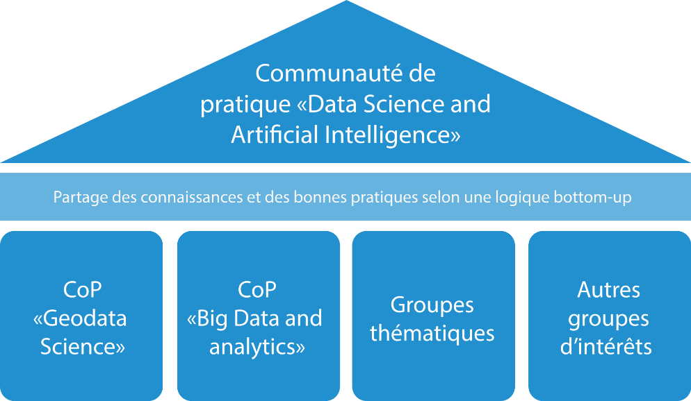

## Communauté: Science des données et IA pour le bien commun

Le Centre de compétences en science des données (DSCC) recourt à la science des données et développe des compétences dans l’intérêt public partout en Suisse. Le lien de confiance avec le public est primordial: les services en science des données du DSCC sont proposés en toute transparence. Leurs résultats et les enseignements qui en découlent sont librement accessibles (pour autant que la législation, en particulier celle sur la protection des données, le permette) dans le but de générer une plus-value durable pour l’ensemble de l’administration.

Légende: unique communauté de pratique (Community of Practice – CoP) en matière de science des données au sein de l’administration fédérale

## Communauté de pratique Data Science and Artificial Intelligence (CoP DS&AI)

Dans le cadre de la mise en œuvre de la Stratégie de la Confédération en matière de science des données, le Centre de compétences en sciences des données (DSCC) a fondé la Community of Practice for Data Science and Artificial Intelligence (CoP DS&AI).

La mise en place d’une communauté d’utilisateurs de la science des données au sein de l’administration publique sert l’intérêt général puisqu’elle assure l’échange permanent des savoir-faire et des connaissances techniques. Pour ce faire, la CoP DS&AI cherche à faciliter tous types de conversations «bottom-up» touchant à toute problématique en lien avec la science des données.

Sujets traités par la CoP DS&AI (liste non exhaustive):

* Bonnes pratiques (explicabilité, reproductibilité, etc.)
* Nouvelles méthodes en science des données et partage des connaissances
* Mutualisation des ressources et des outils de science des données
* IA générative et grands modèles de langage (Large Language Models, LLM)
* Défis et bases légales

Partie intégrante du Réseau de compétences en intelligence artificielle, le DSCC encourage les échanges entre divers groupes d’intérêt.
