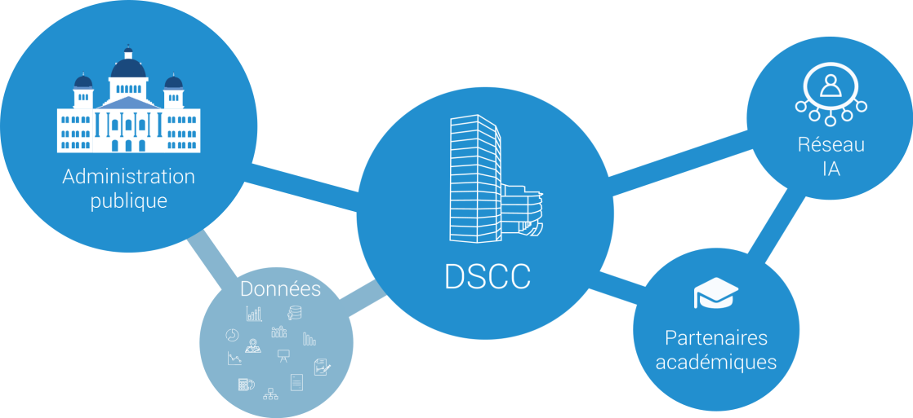
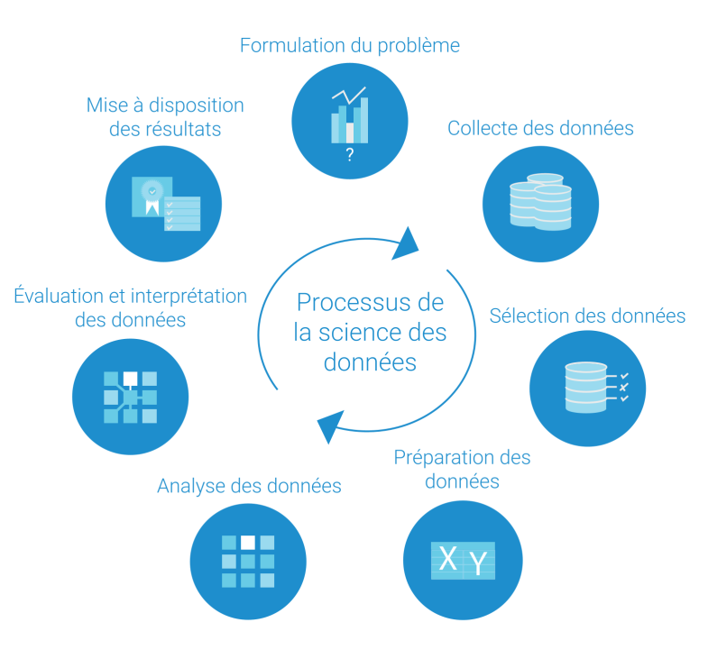

# Centre de compétences en science des données

Prestataire faisant partie de l’administration fédérale, le Centre de compétences en science des données (DSCC) fournit des services en matière de science des données et intelligence artificielle (IA) et met son savoir-faire à la disposition de toutes les administrations publiques en Suisse (Confédération, cantons et communes). Dans le but d’apporter des compétences à la pointe du progrès, le centre de compétences met à profit les synergies existantes au sein d’un réseau interconnecté de partenaires universitaires et collabore étroitement avec le domaine recherche et développement du secteur public.

Positionnement du Centre de compétences en science des données (DSCC) au sein de l’écosystème public suisse de la science des données.

## Brève définition de la science des données

La science des données traite des ensembles de données pour en extraire des connaissances facilitant la prise de décisions. Elle couvre toutes les étapes du processus: formulation du problème, collecte, sélection, préparation et analyse des données, puis évaluation et interprétation des données, enfin communication et mise à disposition des résultats. Par conséquent, les processus de résolution de problèmes et d’amélioration continue constituent les pièces maîtresses de cette science. Conjointement, ces deux processus doivent permettre de résoudre des problèmes complexes, impliquant de grandes quantités de données dans un environnement non structuré, grâce à l’application rigoureuse de méthodes (apprentissage automatique, intelligence artificielle, etc.), de techniques et de pratiques novatrices.

Recourant à une démarche d’amélioration continue, la science des données est un processus de résolution de problèmes rigoureux et documenté.

### Vision

Nous recourons à la science des données et développons des compétences pour le bien commun dans toute la Suisse (for public good).

### Mission

Nous travaillons à la frontière entre la science des données et l’intelligence artificielle. Nous développons des compétences et utilisons les méthodes, techniques et pratiques requises pour créer une nouvelle compréhension du domaine et pour faciliter la prise de décisions pour le bien de la collectivité (for public good).

### Valeurs fondamentales

Sécurité des informations, protection des données et de l’information, sécurité et gouvernance des données, non-discrimination, explicabilité, transparence, reproductibilité, neutralité, objectivité, traitement éthique des données et des résultats: telles sont les valeurs fondamentales qui nous caractérisent.

Ces valeurs culminent dans la certitude des citoyens que tous les services de la science des données sont mis à profit dans l’intérêt général. Par exemple, les résultats de chaque projet sont documentés de manière transparente et mis à disposition, pour autant que la législation, en particulier celle sur la protection des données, le permette.

Le Centre de compétences en science des données (DSCC) s’efforce de générer de la valeur pour le bien de la collectivité de manière durable.
