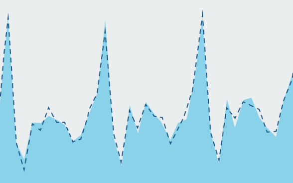

# Méthodes statistiques

Des fichiers et des instructions sont mis à la disposition du public. Ces derniers visent à permettre l'application ciblée de méthodes statistiques aux différents types de données. methodes-statistiques

## Méthodes de correction des effets calendrier en usage à l'OFS en 2023

Des fichiers et programmes permettant de corriger les effets calendrier de séries temporelles sont mis à disposition par l’Office fédéral de la statistique. Un rapport de méthodes décrit en détail aussi bien les aspects théoriques que l’application pratique de ces fichiers/programmes et leur utilisation.

## Construction, choix et application des régresseurs mis à disposition

L'OFS a publié un rapport de méthodes sur la correction des effets calendrier des séries temporelles. Dans ce cadre, des fichiers sont mis à disposition du public sous la forme d'une archive au format .zip.

L'objectif est de permettre aux utilisateurs d'effectuer de façon autonome des corrections d'effets calendrier sur leurs propres séries temporelles. L'archive .zip ci-dessous contient ainsi en les fichiers suivants :

* Des documents texte au format .dat, contenant des "régresseurs" calculés selon plusieurs options de modélisation. Ces fichiers peuvent servir de fichiers d'entrée (input) pour des programmes tels que X13-ARIMA-SEATS (en anglais).
* Des programmes écrits en langage R qui permettent de construire automatiquement les fichiers .dat décrits précédemment,
* Un fichier readme.txt (en anglais).

Un exemple d'utilisation des fichiers d'input au format .dat pour corriger les effets calendrier d'une série temporelle est donné dans le rapport de méthodes en section 5 et en annexe A.
