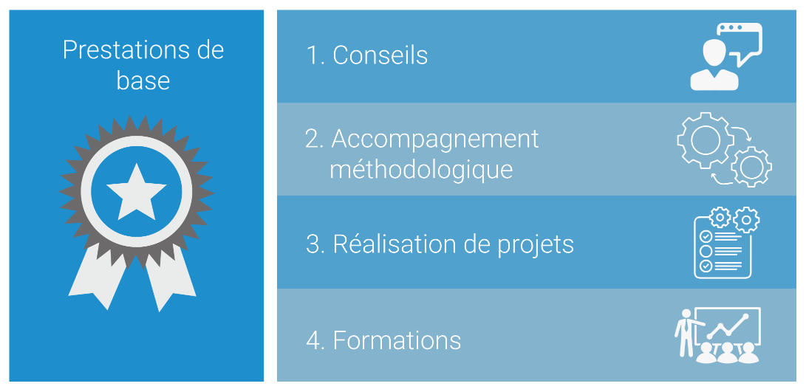

## Science des données en tant que service

Le Centre de compétences en science des données (DSCC) propose aux unités de l’administration des prestations dans le domaine de la science des données selon le principe de la science des données en tant que service (Data Science as a Service, DSaaS). Dans le cadre de son mandat, selon lequel il incombe au DSCC de fournir des services d’intérêt public, son champ d’action s’étend exclusivement au secteur public, à savoir à la Confédération, aux cantons et aux communes.

## Prestations de services en science des données et IA

Dans le cadre de sa mission de prestataire de services d’intérêt public et en étroite collaboration avec ses partenaires universitaires et institutionnels, le DSCC établit des normes de qualité et des directives pour le respect de la protection des données et développe des infrastructures de base (sandboxes) pour les applications utilisées en science des données et IA dans le secteur public.

Le DSCC offre, outre ces prestations de base, les prestations de service suivantes:

1. Conseils

> Conseils prodigués à l’administration fédérale sur l’application stratégique, tactique et opérationnelle de méthodes et de processus innovants en matière de science des données (analyse du potentiel que présentent les procédures tirées de la statistique avancée, de l’apprentissage automatique, du domaine de l’IA, etc.).

2. Accompagnement méthodologique

> Accompagnement méthodologique (coaching – training on the job) pour la mise en œuvre de projets réalisés en interne ou confiés à des externes. Intégration des résultats dans les processus administratifs existants dans le but de les optimiser, notamment en offrant une nouvelle perspective.

3. Réalisation de projets

> Exécution complète de projets pertinents en science des données, de la formulation du problème (compréhension du cas, business understanding) à l’obtention d’un produit minimum viable (minimum viable product, MVP). Si l’ampleur du projet l’exige, le DSCC fait appel à ses partenaires institutionnels et universitaires.

4. Formations

> Formations (training, training off the job) axées sur l’application des méthodes, techniques et pratiques de la science des données ainsi que sur l’utilisation des technologies et outils informatiques requis.
